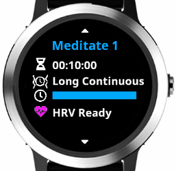
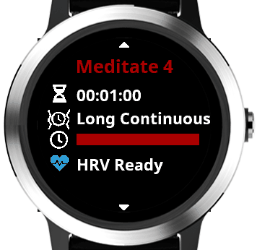
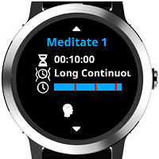
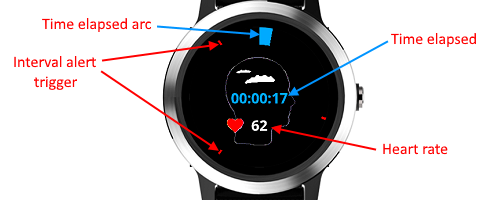
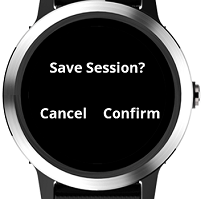
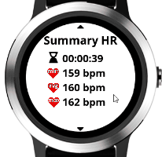
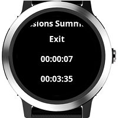
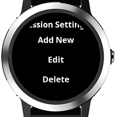
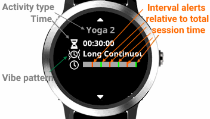
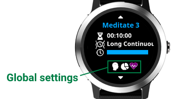

# User Guide

## Features

- ability to save the session as a Connect IQ activity
    - activity type **Meditating** or **Yoga**
- ability to configure multiple meditation/yoga sessions
    - e.g. a 20 min session with 1 min recurring alerts, triggering a different alert on the 10th minute
    - each session supports interval vibration alerts
    - interval alerts can trigger from a few seconds up to few hours
- [HRV](https://en.wikipedia.org/wiki/Heart_rate_variability) (Heart Rate Variability)
    - RMSSD - Root Mean Square of Successive Differences (beat-to-beat intervals)
    - pNN20 - % of successive beat-to-beat intervals that differ by more than 20 ms
    - pNN50 - % of successive beat-to-beat intervals that differ by more than 50 ms
    - beat-to-beat interval - reading coming directly from the watch sensor
    - HRV Successive Differences - difference between the current and previous beat-to-beat intervals
    - SDRR - [Standard Deviation](https://en.wikipedia.org/wiki/Standard_deviation) of beat-to-beat intervals 
      - calculated from the first and last 5 min of the session
    - HRV RMSSD 30 Sec Window - RMSSD calculated for consecutive 30 second intervals    
    - HR from heartbeat - beat-to-beat interval converted to HR
- stress tracking
    - Stress - summary of the the average stress during the session 
    - HR Peaks 10 Sec Window
      - internal metric for calculating stress 
      - tracks in overlapping 10 Sec Windows Max HR for each window 
      - HR calculated from beat-to-beat interval
- summary stats at the end of the session
    - tracks the overall min, avg and max HR
    - Stress
    - HRV

## How to Use
### 1. Starting a session

1.1. From the session picker screen press the start button. 

1.2. The session in-progress screen contains the following elements
- time elapsed arc 
    - shows the percentage of elapsed session time
    - full circle means session time has elapsed
- interval alert triggers 
    - the small colored marks represent the time of trigerring an interval alert
    - each marked position corresponts to an alert trigger time
    - you can hide them per alert by selecting transparent color from the [Interval Alerts settings menu](#2-configuring-a-session)
- time elapsed 
- current HR
- current HRV Successive Difference 
  - difference between the current and previous beat-to-beat intervals measured in milliseconds
  - shows only when HRV tracking is on
  - **to get good HRV readings you need to minimise wrist movement**

The meditation session finishes once you press the stop button.

1.3. Once you stop the session you have the option to save it.

1.3.1 You can configure to auto save or auto discard the session via [Global Settings](#4-global-settings) -> [Confirm Save](#42-confirm-save)

1.4. If you are in single session mode (the default) at the end you see the Summary Screen (for Multi-Session mode see the next section **1.5**). Swipe up/down (Vivoactive 3/4/Venu) or press page up/down buttons to see the summary stats of HR, Stress and HRV. Go back from this view to exit the app.

1.5 If you are in multi-session mode (determined by [Global Settings](#4-global-settings) -> [Multi-Session](#43-multi-session)) then you go back to the session picker screen. From there you can start another session. Once you finish your session you can go back from the session picker screen to enter the Sessions Summary view.

1.6 From the Sessions Summary view you can drill-down into individual sessions or exit the app. Drilling-down shows summary stats of HR, Stress and HRV. If you go back from the Sessions Summary view you can continue doing more sessions.

### 2. Configuring a session

2.1 From the session picker screen hold the menu button until you see the Session settings menu.
  - for Vivoactive 3 hold on the screen 
  - for Vivoactive 4/Venu hold the back button

 

2.2 In Add New/Edit you can configure:
- Time - total duration of the session in H:MM
- Color - the color of the session used in graphical controls; select by using page up/down behaviour on the watch (Vivoactive 3/4/Venu - swipe up/down)
- Vibe Pattern - shorter or longer patterns ranging from pulsating or continuous
- Interval Alerts - ability to configure multiple intermediate alerts
    - once you are on a specific interval alert you see in the menu title the Alert ID (e.g. Alert 1) relative to the current session interval alerts
    - Time 
        - select one-off or repetitive alert
        - repetitive alerts allow shorter durations than a minute
        - only a single alert will execute at any given time
        - priority of alerts with the same time
          1. final session alert
          2. last one-off alert
          3. last repetative alert
    - Color - the color of the current interval alert used in the graphical controls. Select different colors for each alert to differentiate them during meditation. Select transparent color if you don't want to see visual marks for the alert during meditation
    - Vibe Pattern - shorter or longer patterns ranging from pulsating or continuous
- Activity Type - ability to save the session as **Meditating** or **Yoga**. You can configure default activity type for new sessions from the Global Settings ([see section 4](#4-global-settings)).
- HRV Tracking - determines if HRV and stress are tracked
  - ON (Default) - tracks stress and the following HRV metrics
    - RMSSD
    - HRV Successive Differences
  - On Detailed - tracks extra stress and HRV metrics in addition to the **On** option
    - RMSSD
    - HRV Successive Differences
    - pNN20 
    - pNN50
    - beat-to-beat interval
    - SDRR First 5 min of the session
    - SDRR Last 5 min of the session
    - RMSSD 30 Sec Window
    - HR from heartbeat
    - HR Peaks 10 Sec Window

2.3 Delete - deletes a session after asking for confirmation

2.4 Global Settings - [see section 4](#4-global-settings)

### 3. Picking a session

From the session picker screen press page up/down buttons (for Vivoactive 3/4/Venu - swipe up/down).
On this screen you can see the applicable settings for the selected session
- activity type - in the title
  - Meditate
  - Yoga
- time - total duration of the session
- vibe pattern
- interval alert triggers - the graph in the middle of the screen represents the relative alert triger time compared to the total session time
- HRV indicator
  -  Off - indicates that stress and HRV are turned off
  -  Waiting HRV 
    - the hardware sensor does not detect HRV
    - you can start the session but you will have missing HRV data
  -  HRV Ready 
    - the hardware sensor detects HRV
    - the session tracks default HRV and Stress metrics
    - **the session can be recored with reliable HRV data provided you minimize wrist movement**
  -  HRV Ready 
    - the hardware sensor detects HRV
    - the session tracks extended HRV and Stress metrics
    - **the session can be recored with reliable HRV data provided you minimize wrist movement**

### 4. Global Settings

From the session picker screen hold the menu button (for Vivoactive 3 hold on the screen/Vivoactive 4 and Venu - hold the back button) until you see the Session settings menu. Select the Global Settings Menu. You see a view with the states of the global settings.

#### 4.1 HRV Tracking

This setting provides the default **HRV Tracking** for new sessions.

- **On** - tracks default HRV metrics and Stress
    - RMSSD
    - Successive Differences
    - Stress
- **On Detailed** - extended HRV and Stress metrics
    - RMSSD
    - Successive Differences
    - Stress
    - beat-to-beat interval
    - pNN50
    - pNN20
    - HR from heartbeat
    - RMSSD 30 Sec Window
    - HR Peaks 10 Sec Window
    - SDRR First 5 min of the session
    - SDRR Last 5 min of the session
- **Off** - HRV and Stress tracking turned off

#### 4.2 Confirm Save

- Ask - when an activity finihes asks for confirmation whether to save the activity
- Auto Yes - when an activity finihes auto saves it
- Auto No - when an activity finihes auto discards it

#### 4.3 Multi-Session

- Yes 
  - the app continues to run after finishing session
  - this allows you to record multiple sessions
- No - the app exits after finishing session

#### 4.4 New Activity Type

You can set the default activity type for new sessions.

- Meditating
- Yoga