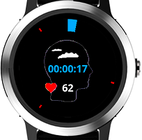
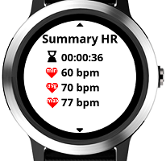
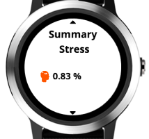
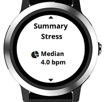
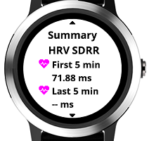
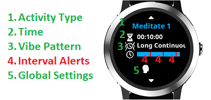
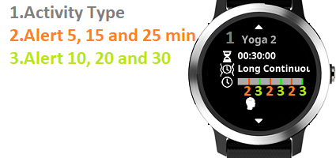

# User Guide

## Features
- ability to save the session as a Connect IQ activity (optional)
    - save as **Meditating** or **Yoga**
- stress tracking
    - analyses in overlapping 10 Sec Windows Max-Min HR (reported as Max-Min HR 10 Sec Window chart on Connect IQ)
    - tracks the median of the Max-Min HR windows as a summary field (Stress Median field on Connect IQ)
    - calculates stress into 3 cathegories - **No**, **Low** and **High**
        - No - % of Max-Min Windows that are <= **stress median**
        - Low - % of Max-Min Windows that are > **stress median** and < 3x **stress median**
        - High - % of Max-Min Windows that are >= 3x **stress median**
- tracks the overall min, avg and max HR
- ability to configure multiple meditation/yoga sessions
    - e.g. a 20 min session with 1 min recurring alerts, triggering a different alert on the 10th minute
    - each session supports interval vibration alerts
    - interval alerts can trigger from a few seconds up to few hours
- summary stats at the end of the session
- [HRV](https://en.wikipedia.org/wiki/Heart_rate_variability) (Heart Rate Variability) - optional
    - this approximates current HR to beat-to-beat intervals to calculate [Standard Deviation](https://en.wikipedia.org/wiki/Standard_deviation) of the first and last 5 min of the session
    - the Vivoactive 3 HR sensor is too unreliable to produce usable intervals data for algorithms that analyse successive beat-to-beat intervals like RMSSD (it flattens the readings)

## How to Use
### 1. Starting a session

From the session picker screen press the start button. You see the current elapsed time drawn as an arc with the color of the selected session. Once the arc becomes full circle the session time has elapsed.
The small colored marks represent the time when interval alert will trigger. The interval alert trigger is drawn relative to the total session time.
The time elapsed and the current HR are at the middle of the screen.
The meditation session finishes once you press the stop button.
Once you stop the session you have the option to save it.
Finally you see the Summary Screen. Swipe up/down (Vivoactive 3) or press page up/down buttons to see the summary stats of HR, Stress and HRV.

     
### 2. Configuring a session

From the session picker screen hold the menu button (for Vivoactive 3 hold on the screen) until you see the Session settings menu.
In Add New/Edit you can configure:
- Time - total duration of the session in H:MM
- Color - the color of the session used in graphical controls; select by using page up/down behaviour on the watch (Vivoactive 3 - swipe up/down)
- Vibe Pattern - shorter or longer patterns ranging from pulsating or continuous
- Interval Alerts - ability to configure multiple intermediate alerts
    - once you are on a specific interval alert you see in the menu title the Alert ID (e.g. Alert 1) relative to the current session interval alerts
    - Time - select one-off or repetitive alert; repetitive alerts allow shorter durations than a minute
    - Color - the color of the current interval alert used in the graphical controls. Select different colors for each alert to differentiate them during meditation. Select transparent color if you don't want to see visual marks for the alert during meditation
    - Vibe Pattern - shorter or longer patterns ranging from pulsating or continuous
- Activity Type - ability to save the session as **Meditating** or **Yoga**. You can configure default activity type for new sessions from the Global Settings (see section 5).
- Global Settings - see bellow section 4. Turning on/off Stress and HRV

  

### 3. Selecting a session

Once you have more than one session you can select a session by using the page up/down behaviour on the watch (Vivoactive 3 - swipe up/down). Each session is displayed in the configured color. The session activity type - Meditate or Yoga is displayed in the title. The graph in the middle of the screen represents the relative time when interval alerts will trigger compared to the total session duration.

   

### 4. Turning on/off Stress and HRV

From the session picker screen hold the menu button (for Vivoactive 3 hold on the screen) until you see the Session settings menu. Select the Global Settings Menu. Select the setting you wish to change. Once you are done you can see which features are turned on the currently selected session in the bottom icons row.
-  Stress tracking is On (tracking summary metrics of No, Low and High Stress)
-  Detailed Stress tracking is On (tracks additionally stress median and Max-Min HR Windows Graph)
-  HRV tracking is On (tracks the standard deviation HRV of the first and last 5 min intervals of the session)

### 5. Connect IQ New Activity Type

You can set the default activity type for new session as **Meditating** or as **Yoga**. To do this go to the session picker screen, hold the menu button (for Vivoactive 3 hold on the screen) until you see the Session settings menu. Select the Global Settings Menu -> New Activity Type 